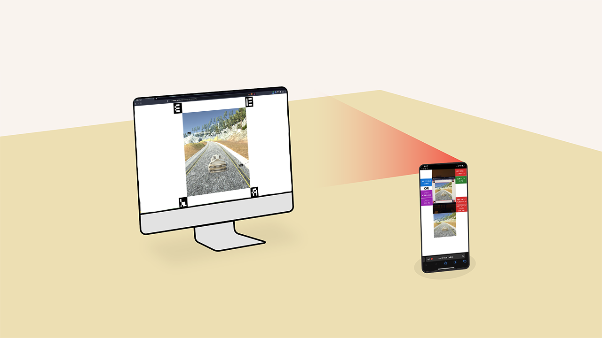

This project represents my MSc dissertation, and it introduces a highly valuable, cost-effective, and engaging system designed to empower smartphones for deep learning and programming education. The project's core components were developed using JavaScript, encompassing both the environment creation and machine learning model implementation.

Click [this](https://claretb.github.io/self-driving-car-simulation/) link to use the system. Instructions for the system can be found [here](https://www.youtube.com/watch?v=ntBm9mr4_ug).

You can find the project repo [here](https://github.com/claretb/self-driving-car-simulation), and the dissertation document [here](https://drive.google.com/file/d/1XmUcTD_SkJGJN9s-Ht3-bgpzIify3lr6/view?usp=drive_link) for more information.
