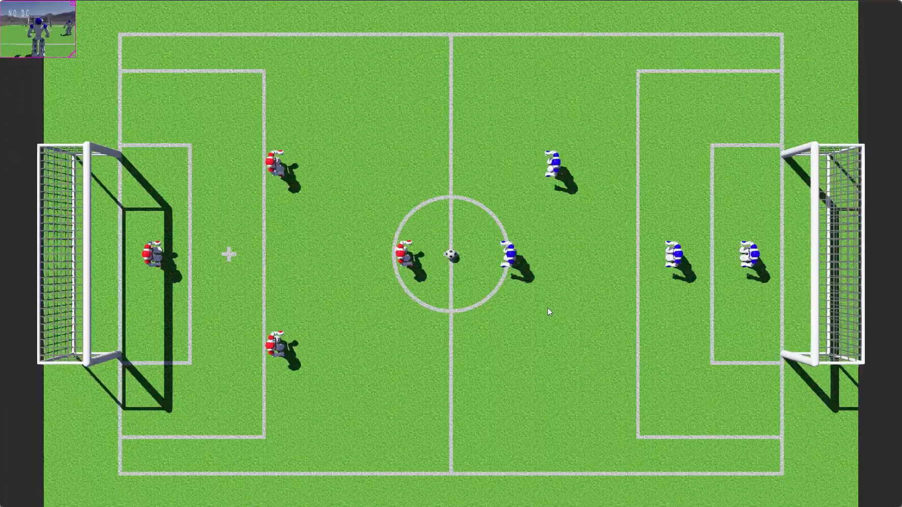

During my MSc program, our team worked together to create a robot soccer simulation in the Webots robotics simulation environment. Our group consisted of six individuals with various academic backgrounds, which brought a diverse set of perspectives to the project. In this simulation, we organized exciting 4 vs. 4 soccer matches, with each team employing different strategies and techniques to play the game. The entire project was coded using the Python programming language, highlighting Python's flexibility and effectiveness in the field of robotics and artificial intelligence.

You can find the project repo [here](https://github.com/claretb/RoboCupSoccer).
